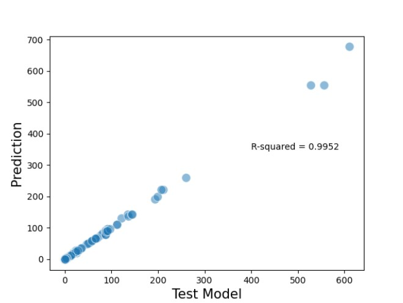

Linear Regression is used to identify the relationship between
the variables. Linear regression is either simple linear regression or multiple linear
regression. It is focused mainly upon the conditional probability distribution with
analysis.

Below is the graph plotted between the "Test Model" and the "Predicted Model".

This model predicts well with a accuracy of 99.52% against the Test model.

A more detailed explaination of the creation of this graph is presented in the following link to my Thesis.
