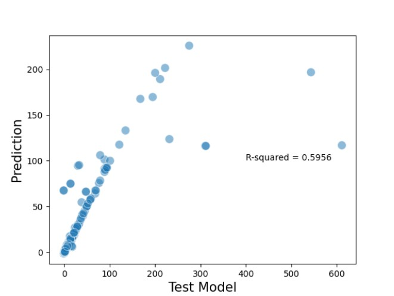

The objective of support vector machine is to find
out the best hyperplane in more than two dimensions in order to find out how
to separate the space into classes.

Below is the graph plotted between the "Test Model" and the "Predicted Model".

This model predicts well with a accuracy of 59.56% against the Test model.

A more detailed explaination of the creation of this graph is presented in the following link to my Thesis.