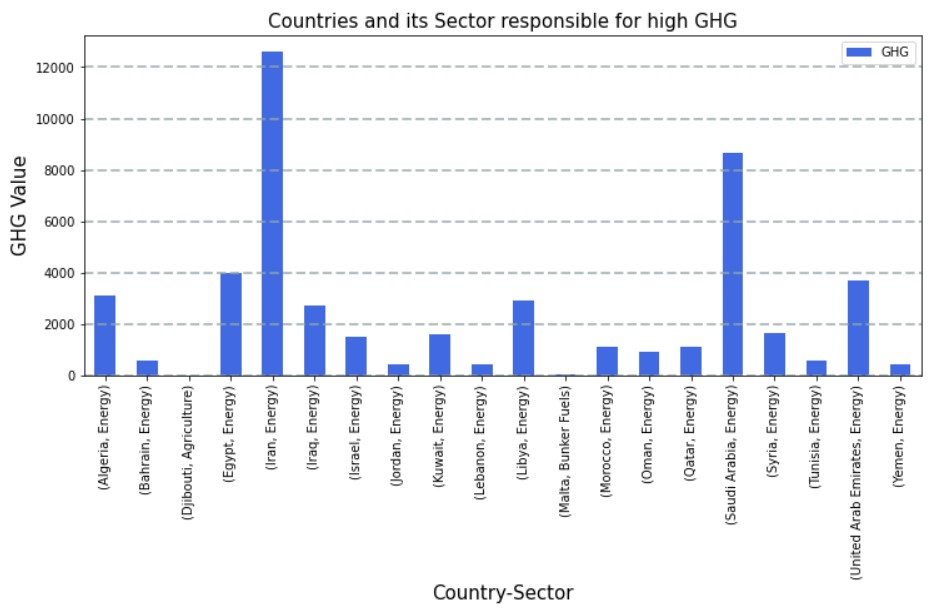

From the graph below, we can observe that from the entire Middle Eastern countries, **Iran** is the highest emitter of the Greenhouse Gas, and 
the sector responsible for the most part is the **Energy sector** of Iran.

The x-axis contains the name of the country and the sector with the highest contributer of GHG gas.

The GHG values on the y-axis is all the accumulated GHG values from the years 1990-2016 for each country.

A more detailed explaination of the creation of this graph is presented in the following link to my Thesis.