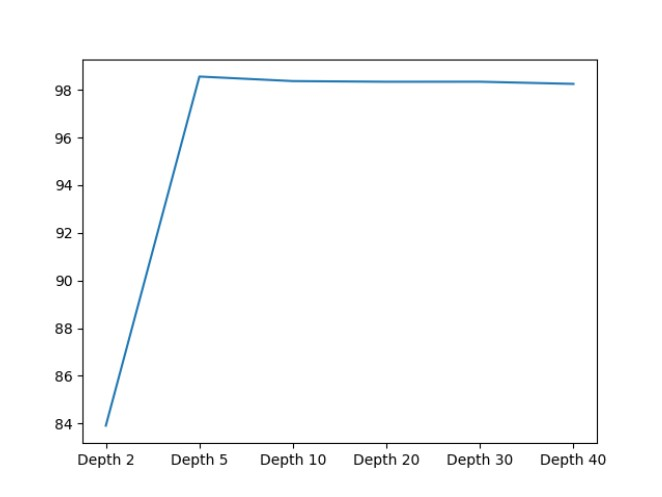
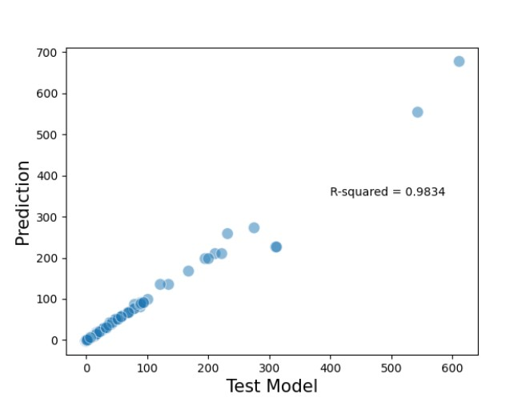

The Decision Tree is classifed as a predictive model which is
charting from observations form a dataset to conclude its target value. The leaves
in a decision tree structure signify labels and the non-leaf parts are the features,
and the branches signify conjunctions of the features that lead to the classifcation

Below is the graph to show the accuracy across between depths in a decision tree. From the graph we can see that the accuracy of the model is pretty much even after Depth 5.

Below is the graph plotted between the "Test Model" and the "Predicted Model", the predicted model used here is from the Depth 20, which gives us the highest accuracy.

A more detailed explaination of the creation of this graph is presented in the following link.